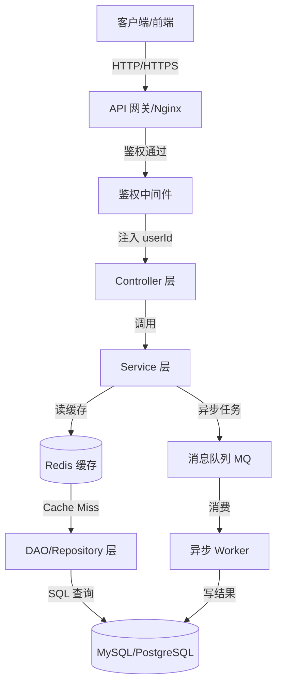
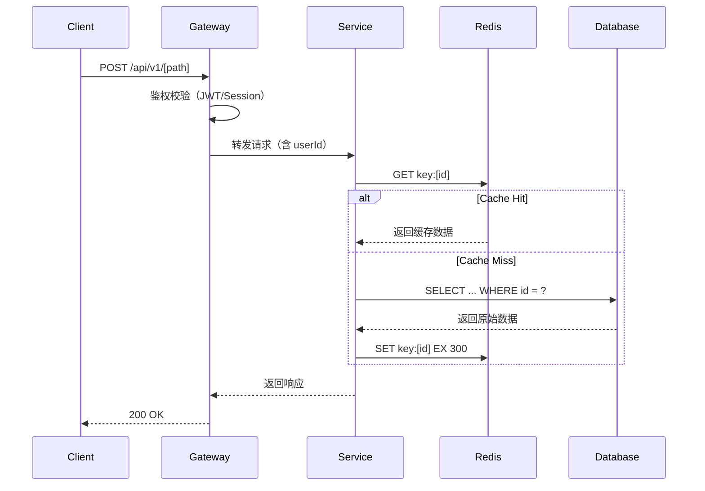
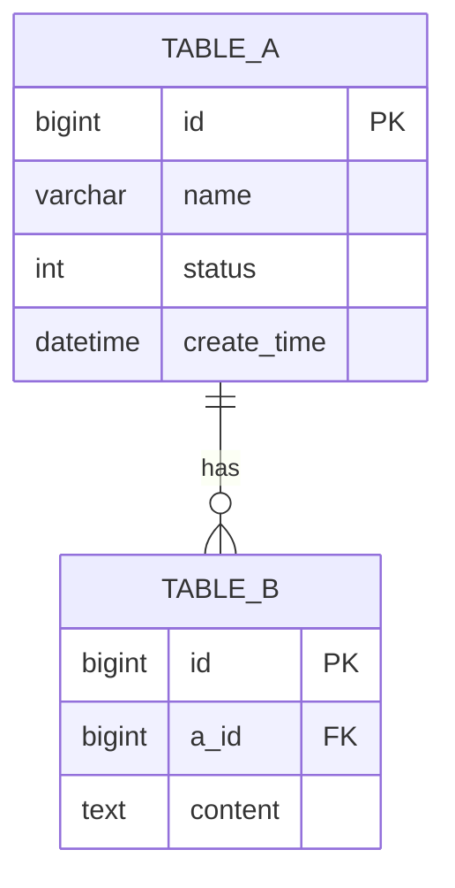

# architecture.md 模板

生成架构文档时使用此模板。Mermaid 图必须体现请求从网关到数据库的完整链路。

---

```markdown
# 系统架构文档

> **版本**：v1.0 | **最后更新**：[日期]

---

## 系统概览

[2-3 句话描述系统核心职责和边界]

---

## 整体架构图



---

## 核心时序图

### [核心业务流程名] 时序



---

## 模块职责

### [模块名称]

**职责**：[该模块做什么，不做什么]

**关键类**：
- `[ClassName]`：[职责]
- `[ClassName]`：[职责]

**依赖关系**：依赖 [上游模块]，被 [下游模块] 依赖

---

## 数据库 ER 图



---

## 缓存策略

| 缓存 Key 格式 | TTL | 更新时机 | 降级策略 |
|--------------|-----|---------|---------|
| `[key:pattern]` | [秒] | [写操作后] | [降级行为] |

---

## 非共识技术决策记录

| 决策点 | 选择 | 原因 | 放弃的方案 |
|--------|------|------|-----------|
| [决策] | [选择] | [原因] | [备选] |
```
