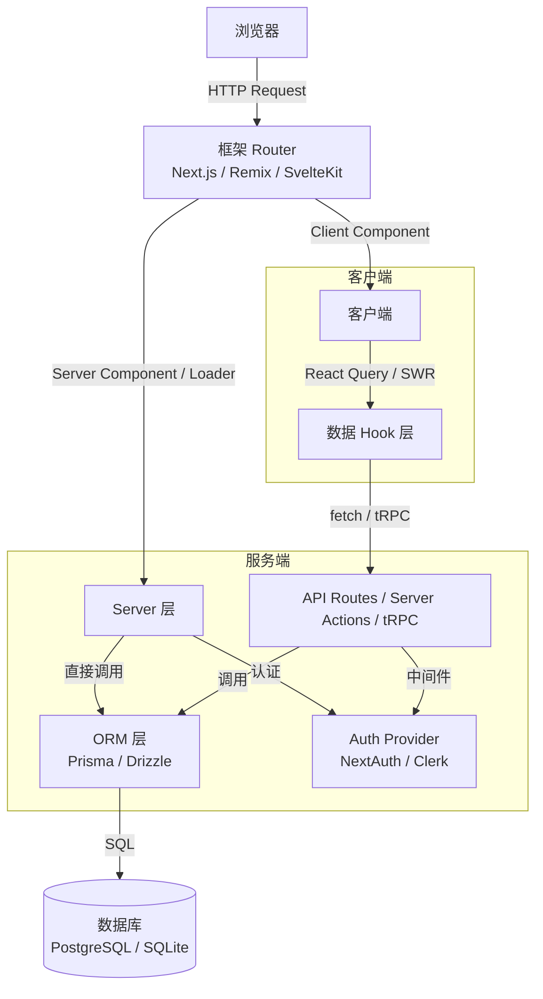
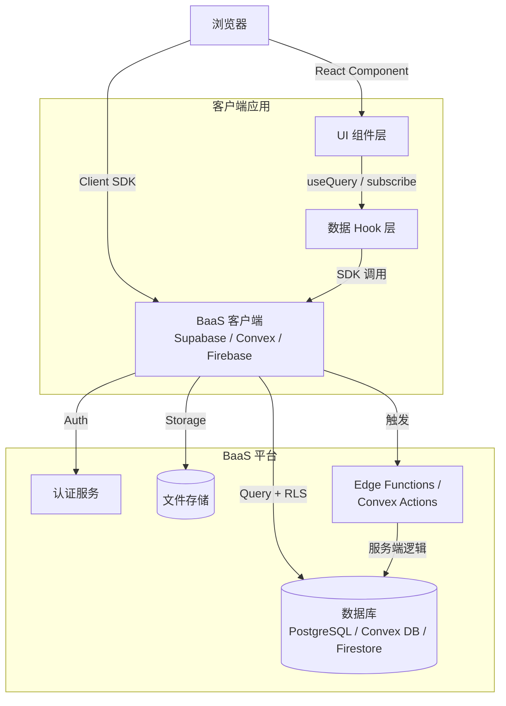
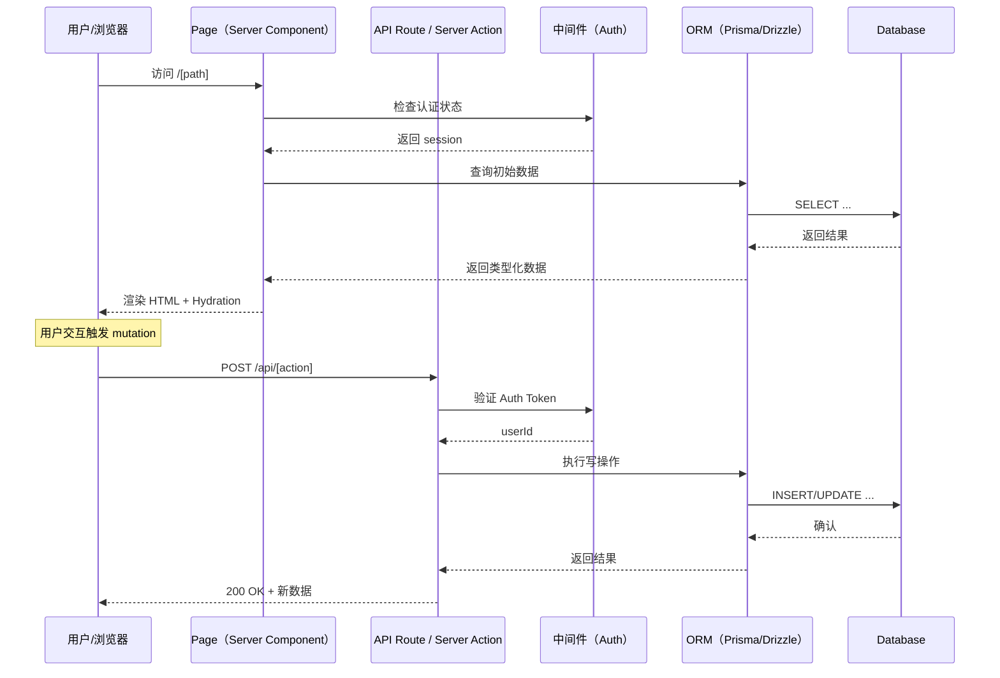
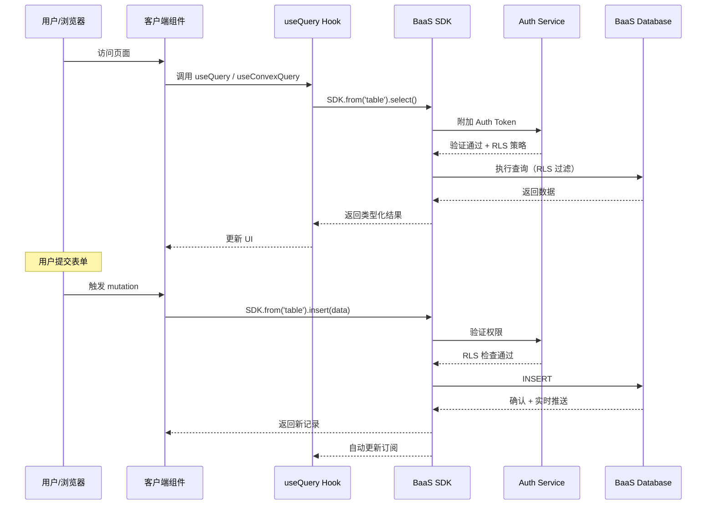
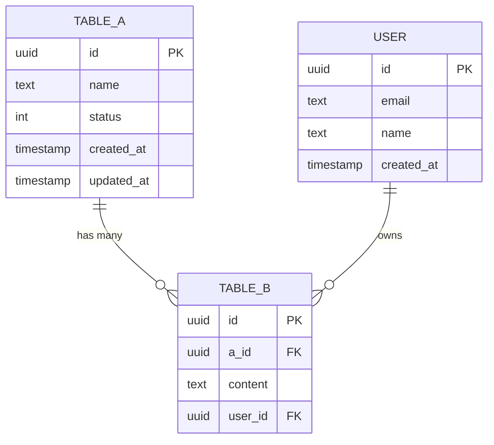

# ARCHITECTURE.md 模板（全栈版）

生成架构文档时使用此模板。Mermaid 图必须体现从用户交互到数据持久化的完整链路。

---

```markdown
# 系统架构文档

> **版本**：v1.0 | **最后更新**：[日期]

---

## 系统概览

[2-3 句话描述系统核心职责和边界]

---

## 整体架构图

### 全栈框架模式（Next.js / Remix / SvelteKit 等）



### BaaS 模式（Supabase / Convex / Firebase）



---

## 核心数据流时序图

### [核心业务流程名] — 全栈框架模式



### [核心业务流程名] — BaaS 模式



---

## 数据库 Schema



---

## 环境变量

### 客户端可见（安全）

| 变量名 | 说明 | 示例 |
|--------|------|------|
| `NEXT_PUBLIC_SUPABASE_URL` | BaaS 端点 | `https://xxx.supabase.co` |
| `NEXT_PUBLIC_SUPABASE_ANON_KEY` | BaaS 匿名公钥 | `eyJhbG...` |

### 服务端专用（敏感）

| 变量名 | 说明 | 绝不暴露给客户端 |
|--------|------|-----------------|
| `DATABASE_URL` | 数据库连接串 | ✅ |
| `SUPABASE_SERVICE_ROLE_KEY` | BaaS 管理密钥 | ✅ |
| `AUTH_SECRET` | 认证签名密钥 | ✅ |

---

## 模块职责

### [模块名称]

**职责**：[该模块做什么，不做什么]

**关键文件**：
- `[文件路径]`：[职责]
- `[文件路径]`：[职责]

**数据依赖**：操作 [表名/集合名]，被 [下游模块] 消费

---

## 非共识技术决策记录

| 决策点 | 选择 | 原因 | 放弃的方案 |
|--------|------|------|-----------|
| [决策] | [选择] | [原因] | [备选] |
```
