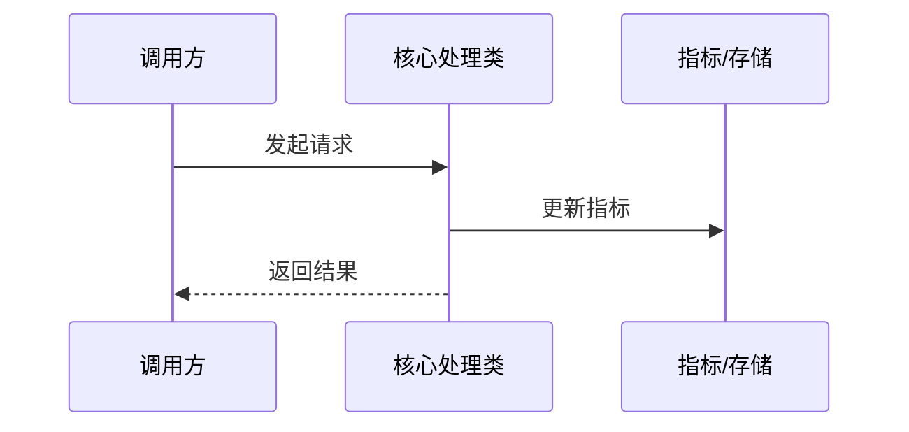
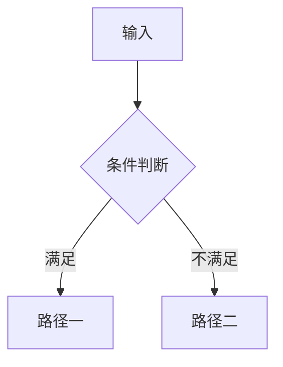

# PR 代码评审

## 概述

对 Pull Request 和分支 Diff 执行自动化代码评审。基于内部编码规范，分析 Java、Python、Golang、C++ 项目的代码变更，输出按优先级排列的结构化评审报告（P0 阻塞 → P3 参考）。

## 输入信息收集

开始评审前，收集以下信息：

**必填（源分支+目标分支）：**
包含以下三种情况
- 用户提问与某个分支的差异，当前分支可能还未提交，需要看项目当前未提交代码与目标分支的差异
- 用户显式给出源分支和目标分支
- 用户给出PR/MR链接，**获取到源分支和目标分支之后切记在本地执行diff，Mcp工具返回的diff过长会被截断**

**可选：**
- 编程语言 / 框架（未提供时从 diff 自动检测）
- 重点关注领域：安全 / 性能 / 架构

## 编码规范参考

评审对应语言代码时，从 `references/` 目录加载相应的编码规范文件：

| 语言 | 规范文件 |
|------|---------|
| Java | `references/java-code-rules.md` |
| Python | `references/python-code-rules.md` |
| Golang | `references/golang-code-rules.md` |
| C++ | `references/cpp-code-rules.md` |

**规范文件内快速检索的 grep 关键词：**
- 安全规范：grep `安全` 或 `【强制】.*SQL\|注入\|XSS\|CSRF\|硬编码\|反序列`
- 并发规范：grep `并发\|线程\|锁\|goroutine\|volatile`
- 异常处理：grep `异常\|Exception\|error\|panic`
- 性能规范：grep `性能\|内存\|N+1\|分页\|循环`

## 评审优先级框架

### P0 — 阻塞（必须修复）
**正确性：**
- 逻辑错误、空指针解引用、资源泄露
- 并发竞争条件、死锁
- 死循环风险

**安全性：**
- SQL 注入（SQL 字符串拼接、MyBatis 中使用 `${}`）
- XSS / CSRF 漏洞
- 硬编码凭据、私钥、密码
- 权限绕过、不安全反序列化
- 对用户输入执行 `eval`/`exec`（Python）
- 弱加密或禁用算法（MD5、DES、RC4）

### P1 — 重要（强烈建议修复）
**鲁棒性：**
- 异常处理缺失、异常被吞掉
- 边界条件未处理、输入校验不足
- 关键操作缺少幂等性保障
- RPC / 远程调用结果未做空指针判断

**性能：**
- 明显性能瓶颈、内存泄露
- N+1 查询
- 大数据集未分页
- 循环内字符串拼接（Java 应使用 StringBuilder）
- 线程池使用不当（Java：必须使用 ThreadPoolExecutor，不能用 Executors）

### P2 — 建议（可选改进）
**可读性：**
- 命名不清晰（拼音英文混用、无意义缩写）
- 函数超过 80 行
- 嵌套深度超过 3 层
- 公有 / 抽象方法缺少必要注释

**可维护性：**
- 重复代码（违反 DRY 原则）
- 魔法数字（未命名的常量直接写在代码中）
- 硬编码配置值
- 过度设计或不必要的抽象

### P3 — 参考（了解即可）
**兼容性：**
- API 破坏性变更未加 `@Deprecated` 注解
- 数据库迁移风险
- 依赖版本冲突

**扩展性：**
- 违反开闭原则
- 紧耦合
- 缺少必要的抽象层

## 评审执行流程

**第零步 — PR 变更解读**

在执行代码评审前，首先对 PR 做整体解读，让评审者一眼看懂这次改动的背景和重点。包含以下内容：

**1. 变更类型识别**

从 diff 中判断变更类型并标注（可多选）：

| 标签 | 含义 |
|------|------|
| `[新功能]` | 新增业务功能或能力 |
| `[重构]` | 不改变行为的代码结构调整 |
| `[Bug修复]` | 修复已知问题 |
| `[性能优化]` | 针对性能的改进 |
| `[依赖升级]` | 第三方库版本变更 |
| `[配置变更]` | 配置项、常量、开关调整 |
| `[测试]` | 仅测试代码变更 |

**2. 变更摘要（2-3句话）**

从业务语义层面概括，回答三个问题：
- 这个改动**解决了什么问题**？
- **核心机制**是什么（对于复杂功能）？
- **影响范围**涉及哪些模块？

**3. 评审重点区域**

根据变更类型和改动范围，主动给出"建议重点看哪里"，帮助评审者把时间花在刀刃上。示例格式：

```
重点关注
  ├── 核心逻辑   →  XxxService.java（算法 / 核心业务逻辑）
  ├── 调用链路   →  AInvoker.java / BHandler.java（关键路径是否完整）
  └── 配置接入   →  XxxConfig.java（新配置项如何生效）
```

**4. 核心流程图（复杂改动时绘制）**

满足以下任一条件时，使用 Mermaid 语法绘制流程图辅助理解：
- 新增类超过 3 个且存在协作关系
- 改动了已有的核心调用链路
- 涉及并发或异步处理逻辑
- 算法逻辑分支超过 3 层

图类型选择：

| 场景 | 图类型 |
|------|--------|
| 多类协作的调用链 / 并发交互 | `sequenceDiagram`（时序图） |
| 算法决策 / 多分支逻辑 | `flowchart`（流程图） |
| 状态变化流转 | `stateDiagram` |

示例（时序图）：


示例（流程图）：

---

**第一步 — 确认评审范围**
获取 diff 后，明确区分主代码与测试代码：

**测试文件识别规则（以下文件一律跳过，不进行评审）：**
- Java：路径含 `src/test/`、文件名以 `Test.java`/`Tests.java`/`Spec.java` 结尾、带 `@Test`/`@SpringBootTest` 注解的类
- Python：文件名以 `test_` 开头或 `_test.py` 结尾，路径含 `tests/` 目录
- Golang：文件名以 `_test.go` 结尾
- C++：文件名含 `_test`/`_spec`，路径含 `test/` 目录
- 通用：路径含 `__tests__/`、`spec/`、`fixtures/` 目录

简要确认：
- 变更文件数量及增删行数（含：主代码 X 个文件 / 测试代码 X 个文件）
- 已排除的测试文件列表（一行列出，不展开分析）
- 检测到的编程语言

**第二步 — 按优先级执行评审**
**只对主代码（非测试代码）进行评审**，测试文件不输出任何评审意见。按 P0 → P1 → P2 → P3 顺序扫描；若发现严重阻塞问题，P0 优先输出。

遇到每种语言时，加载对应的规范文件并应用其规则。

**第三步 — 输出结构化报告**

使用以下报告格式：

---

### 📋 变更摘要
- **评审范围**：`{source_branch}` → `{target_branch}`
- **变更类型**：`[新功能]` / `[重构]` / `[Bug修复]` / `[性能优化]` / `[依赖升级]` 等
- **风险评级**：🔴 高 / 🟡 中 / 🟢 低
- **变更摘要**：2-3句话说明解决了什么问题、核心机制是什么、影响哪些模块
- **重点关注**：列出评审者应重点检查的文件 / 模块及原因
- **核心流程**（复杂改动时附 Mermaid 流程图）

---

### 🚫 阻塞问题（X个）

#### 🔴{类型} 问题标题
📍 **位置**：`文件路径:行号`

```代码片段（关键行）```

- **风险**：具体的安全/正确性影响
- **修复**：具体建议或修复代码示例

---

### ⚠️ 重要建议（X个）

#### 🟡{类型} 问题标题
📍 **位置**：`文件路径:行号`

- **问题**：简述
- **建议**：具体改进方式

---

### 💡 优化建议（X个）

#### 🟢{类型} 问题标题
📍 **位置**：`文件路径:行号`

- **建议**：具体改进方式

---

### ✅ 优秀实践
- 列出代码中的具体亮点（文件位置 + 优点描述）

---

### 📊 问题汇总

| 优先级 | 类型 | 文件 | 问题描述 |
|--------|------|------|---------|
| 🔴 P0 | 正确性/安全性 | `文件名:行号` | 问题简述 |
| 🟡 P1 | 鲁棒性/性能 | `文件名:行号` | 问题简述 |
| 🟢 P2 | 可读性/可维护性 | `文件名:行号` | 问题简述 |
| ℹ️ P3 | 兼容性/扩展性 | `文件名:行号` | 问题简述 |

---

## 评审原则

1. **必要性原则** — 只评论明显有问题或明显可改进的代码，不评论有争议的风格选择
2. **精确定位** — 每个问题必须精确到文件路径和行号范围
3. **建设性反馈** — 每个问题必须附带"为什么有问题"和"怎么改"
4. **安全优先** — 任何安全隐患自动升级为 P0 阻塞问题
5. **上下文感知** — 结合 PR 目的进行评审，不苛求与本次变更无关的完美代码
6. **不重复评论** — 同类问题出现在多处时，合并为一条评审意见，不逐一重复

## 禁止行为

- 不评论代码格式问题（假设有自动化工具处理）
- 不评审第三方依赖库代码
- 不评审测试代码（Test 文件、Spec 文件等），测试文件只在范围确认时列出，不输出任何评审意见
- 不提出与本次变更无关的重构建议
- 不重复评论同类问题

